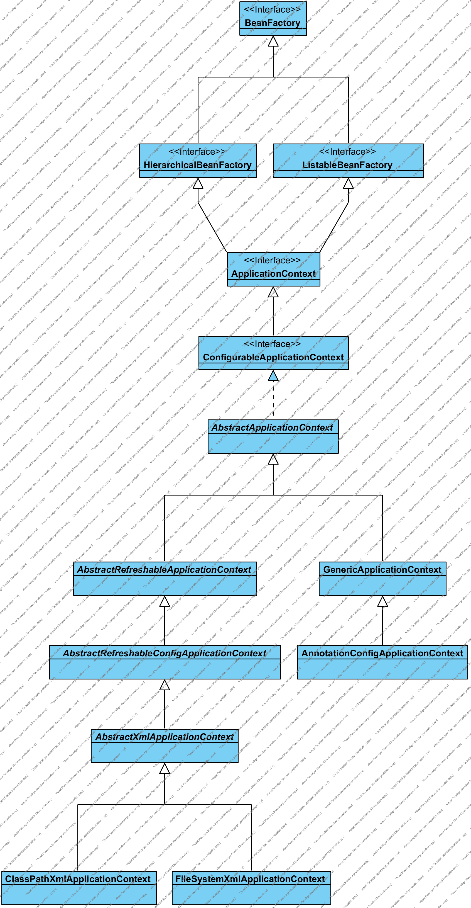

## Spring容器代码结构说明

### 1. 简介

​	想要了解Spring容器代码结构，最简单有效地方式就是画UML。画UML图虽然会耗去很长时间，但是却能够让人从整体上了解到代码结构。有人在看开源项目的时候，会感觉开源项目代码太多，结构太复杂，或者使用了复杂的设计模式等等情况严重妨碍我们阅读源码，这个时候我们就应该使用UML图来辅助我们理解。

### 2. 简化的Spring容器结构

​	下图是一个简化版的Spring容器代码结构。这个结构删除了Web相关的容器，以及一些其他用不到或者对阅读没有帮助的类（例如Groovy支持相关的)。

​	从整体上来看，Spring容器可以分为2部分，一个是BeanFactory，一个是ApplicationContext。

​	BeanFactory顾名思义就是Bean工厂，为什么Spring容器是一个bean工厂呢？这是因为Spring框架是面向Bean编程的，整个Spring容器运用了设计模式中的工厂模式，通过Bean的定义来生产出一个个满足需求的。BeanFactory的主要功能也是创建、管理、配置Bean。
	ApplicationContext是应用的上下文，在继承了BeanFactory同时，增加了应用上下文的信息（比如：配置信息、应用状态等）

​	希望通过下图，能够给大家带来帮助理解Spring容器的代码

### 3. 简单介绍类功能

1. BeanFactory、HierarchicalBeanFactory、ListableBeanFactory

   定义了一些获取bean的方式，是否包含bean，bean是否为原型的一些基本方法，其中HierarchicalBeanFactory和ListableBeanFactory是简单的BeanFactory功能的增强

2. ApplicationContext、ConfigurableApplicationContext

   定义应用上下文的基本信息

3. AbstractApplicationContext

   容器整体功能的基本实现，其中refresh()方法定义了容器启动的流程。

4. AbstractRefreshableApplicationContext，AbstractRefreshableConfigApplicationContext

   新增了刷新容器的实现

5. AbstractXmlApplicationContext、ClassPathXmlApplicationContext、FileSystemXmlApplicationContext

   AbstractXmlApplicationContext实现了XML的配置的解析和加载，ClassPathXmlApplicationContext和FileSystemXmlApplicationContext只是实现了如何去找到XML文件

6. AnnotationConfigApplicationContext

   显现了注解的扫描以及解析过程

### 4.预告与感想

​	下一节写ClassPathXmlApplicationContext的配置和启动过程。多来点人投稿啊！！！！各种技术都可以，不一定非要是Spring啊！！！！