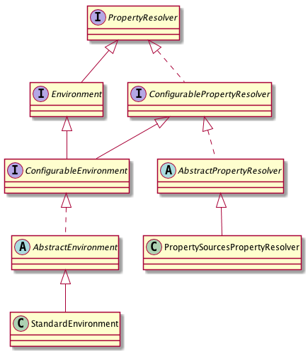

## StandardEnvironment简介

### 一、引言

​	上一节中，我们说到resolvePath方法的时候会先初始化环境信息（代码如下），本次会介绍StandardEnvironment来简要说明StandardEnvironment的实现合作用。

```java
protected String resolvePath(String path) {
	return getEnvironment().resolveRequiredPlaceholders(path);
}
public ConfigurableEnvironment getEnvironment() {
    if (this.environment == null) {
        this.environment = createEnvironment();
    }
    return this.environment;
}
protected ConfigurableEnvironment createEnvironment() {
	return new StandardEnvironment();
}
```

### 二、类图说明

​	老套路，要想了解该类的结构和具体的功能，先画个UML图。



​	从上面的类图可以看出上面的类图可以看出，最上面的根为：PropertyResoler提供的功能类似于我们常用的Properties只不过是提供了一些更加强大的功能而已，比如说可以对值做类型转换或解析属性值中的${xxx}。

​	PropertyResoler向下继续泛化出了Environment和ConfigurablePropertyResolver。ConfigurablePropertyResolver对属性解析增加了一些配置接口，比如说配置属性值的类型转换器服务，设置和校验必填属性等；Environment则提供了默认环境和激活环境（比如说我们可以根据我们的环境不同配置开发环境、测试环境、现网环境的配置，程序启动时激活不同的配置）。

​	ConfigurablePropertyResolver向下泛化成了AbstractPropertyResolver此类到这儿已经成为了一个相当于解析属性的工具类了，它的子类泛化PropertySourcesPropertyResolver只是说明它解析的属性来源于PropertySources。

​	ConfigurableEnvironment继承了Environment和ConfigurablePropertyResolver，此类将属性分成了3中，一个是操作系统的环境变量配置（System.getenv() ），一个是软件的运行环境（System.getProperties ），最后就是应用容器的自定义环境。

​	AbstractEnvironment是对ConfigurableEnvironment的基本实现，开放了一个配置自定义属性的空方法给子类。其中实现了可以通用启动项属性spring.profiles.active 和spring.profiles.default 来配置环境的激活属性、默认属性。其中还可以通过spring.getenv.ignore 属性配置来表示不获取系统的环境变量。

```java
protected void customizePropertySources(MutablePropertySources    propertySources) {
}

```

​	StandardEnvironment 实现了AbstractEnvironment并通过父类提供的空方法customizePropertySources向自定义属性中注入了系统环境变量和系统属性。这里可以将MutablePropertySources暂时理解成盛放属性的一个容器，下届会细节的讲述MutablePropertySources的结构。

```java
protected void customizePropertySources(MutablePropertySources propertySources) {
		propertySources.addLast(new MapPropertySource(SYSTEM_PROPERTIES_PROPERTY_SOURCE_NAME, getSystemProperties()));
		propertySources.addLast(new SystemEnvironmentPropertySource(SYSTEM_ENVIRONMENT_PROPERTY_SOURCE_NAME, getSystemEnvironment()));
}

```

### 三、总结

​	StandardEnvironment在new新对象时初始化了获取了系统环境变量和系统变量，同时自定义了属性源，同时配置了系统激活的属性，对外则提供各种属性的获取和解析，可将其看做是Spring容器中的属性配置容器。

### 四、推荐

​	在此推荐一个画UML非常好用的工具就是plantUML，vscode编辑器安装插件后就支持该UML。plantUML语法可以参考页面:http://plantuml.com/。